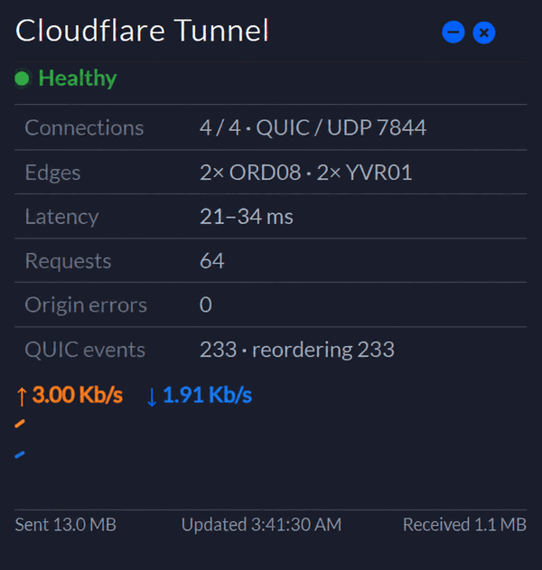

# Cloudflare Tunnel widget for pfSense

A native pfSense dashboard widget for a `cloudflared` tunnel running directly
on the firewall.



The widget uses only local data sources:

- `cloudflared` metrics and `/diag/tunnel` on `127.0.0.1:20241-20245`
- PF state counters for Cloudflare Tunnel traffic on destination port 7844

It does not need or store a Cloudflare API token.

## Displayed information

- Healthy, degraded, or down status
- Active and expected HA connections
- QUIC/UDP or HTTP/2/TCP transport
- Cloudflare edge locations
- Smoothed QUIC RTT range
- Total proxied requests and origin errors
- Cumulative QUIC packet events by reason
- Live sent and received rates sampled every five seconds
- Rolling five-minute traffic graph while the dashboard is open
- Cumulative PF bytes sent and received for the current states

## Requirements

- pfSense CE 2.7.x
- `cloudflared` running locally on pfSense
- Local metrics enabled on one of ports 20241 through 20245
- Cloudflare Tunnel traffic using destination port 7844 for PF traffic counters

Version 1.0.3 was built and tested on pfSense CE 2.7.2 with `cloudflared`
2026.2.0.

## Install

Download
[`cloudflare-tunnel-widget-pfsense-1.0.3.tar.gz`](dist/cloudflare-tunnel-widget-pfsense-1.0.3.tar.gz),
then upload it to pfSense using **Diagnostics > Command Prompt > Upload File**,
or copy it to `/tmp` with SCP.

From console option **8 — Shell**:

```sh
cd /tmp
tar -xzf cloudflare-tunnel-widget-pfsense-1.0.3.tar.gz
cd cloudflare-tunnel-widget-pfsense-1.0.3
sh install.sh
```

Open **Status > Dashboard**, expand **Available Widgets**, and add
**Cloudflare Tunnel**.

Verify the release archive before installing:

```sh
sha256 cloudflare-tunnel-widget-pfsense-1.0.3.tar.gz
```

Expected SHA-256:

```text
52cf87ba2c3925a4c4e924eced396bb1715f264f78ff34eca8fe078912497ea2
```

## Upgrade recovery

pfSense upgrades may replace custom files under `/usr/local/www`. The installer
retains a clean copy under `/conf`, which pfSense normally preserves.

Restore the widget after an upgrade with:

```sh
sh /conf/cloudflare-tunnel-widget/install.sh
```

## Services Status integration

Registering `cloudflared` under **Status > Services** is optional and separate
from the dashboard widget. See
[Optional Services Status integration](docs/service-status.md) for a generic,
single-connector configuration.

## Uninstall

```sh
sh /conf/cloudflare-tunnel-widget/uninstall.sh
```

The retained source and timestamped backups under
`/conf/cloudflare-tunnel-widget` are intentionally preserved.

## Security

The widget reads loopback diagnostics and the local PF state table. It does not
send credentials or telemetry. See [SECURITY.md](SECURITY.md) before including
diagnostic output in a public issue.

## License and trademarks

Released under the [MIT License](LICENSE).

This is an independent community project. It is not affiliated with,
endorsed by, or supported by Cloudflare, Inc. or Netgate. Cloudflare, pfSense,
and related marks belong to their respective owners.
